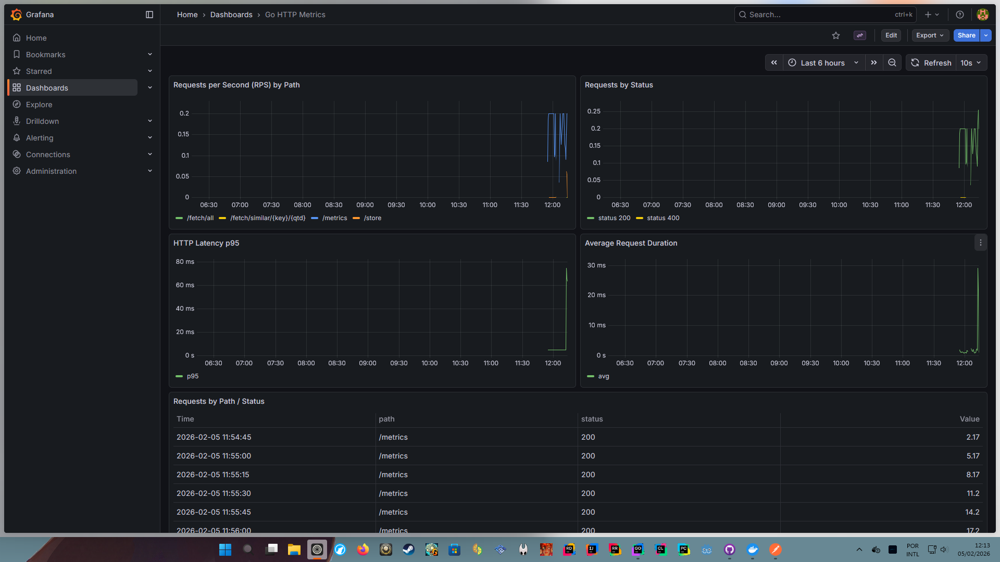

# DIY-VectorDB

Um projeto para aprendizado prático com **Docker**, **bancos de dados vetoriais(Muito utililzado em aplicoes de IA)**, **grafos** e **modelos de linguagem da Ollama**. O foco é explorar a capacidade de buscar informações similares usando embeddings e construir uma API REST e Implementação do [HNSW](https://www.pinecone.io/learn/series/faiss/hnsw/) em **Golang**.

Agora o projeto também possui uma **dashboard em tempo real** com **Grafana** e **Prometheus**, permitindo acompanhar métricas da API e do banco vetorial em tempo real.

---

## Tecnologias Utilizadas

- **Docker**: Para containerização do ambiente e facilidade de execução.
- **Ollama**: Para geração de embeddings através do modelo `embeddinggemma`.
- **Golang**: Linguagem principal para a API REST, e implementação do banco de dados vetorial usando o [HNSW](https://www.pinecone.io/learn/series/faiss/hnsw/), mesmo algoritmo utilizado em nos bancos vetoriais [Milvus](https://milvus.io/pt) e [Qdrant](https://qdrant.tech/).
- **Chi Router**: Para gerenciamento de rotas na API.
- **Prometheus**: Para coletar métricas da API e do banco de dados.
- **Grafana**: Para visualizar métricas em tempo real através de dashboards.

---

## Funcionalidades

Atualmente o projeto possui algumas funcionalidades implementadas e outras planejadas:

- ✅ Gerar embeddings a partir de textos.
- ✅ Receber informações via requisições HTTP.
- ✅ Armazenar informações e embeddings como chave.
- ✅ Pesquisar informações similares usando embeddings.
- 🟡 Implementação do HNSW em memória.
- 🟡 Api rest fazendo aceitando requisções básicas CRUD com HNSW (
    * ✅ Create O(LogN)
    * ✅ Read (
      * ✅ List one O(1)
      * ✅ List all O(N) - N intens no grafo
      * ✅ List similar O(LogN * M) - M = Número máximo de vizinho ( padrão 8) ou intens no grafo se tiver menos de 8 itens
 
    * ✅ Update O(1)
    * 🟡 Delete ( em desenvolvimento)
    
  )
- ⚪ Documentação de rotas Chi
- ✅ Dashboard em tempo real com **Grafana** e **Prometheus**, mostrando métricas de requisições HTTP e performance do banco vetorial.
  
- 


---

## Como Usar

1. **Clone o projeto**

```bash
git clone https://github.com/Thiago-C-Lessa/DIY-VectorDB
cd DIY-VectorDB
```

2. **Inicie o projeto com Docker Compose**  

```bash
docker compose up --build
```
3. **Baixe o modelo embeddinggemma**  
Abra um novo terminal e execute:

```bash
docker exec -it diy-vectordb-ollama-1 ollama pull embeddinggemma:300m
```
Isso é necessário pois a imagem do modelo ainda não está disponível para o conteiner ollama

5. **Reinicie o projeto com Docker Compose**

```bash
docker compose up --build